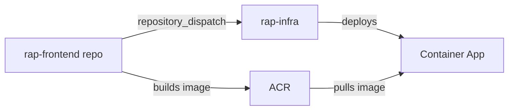
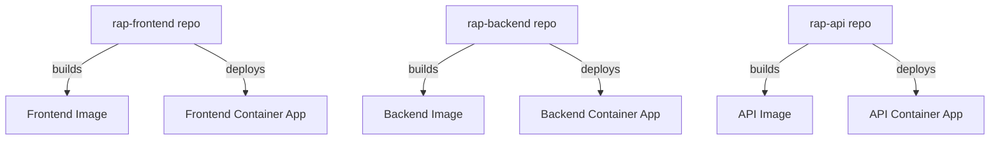
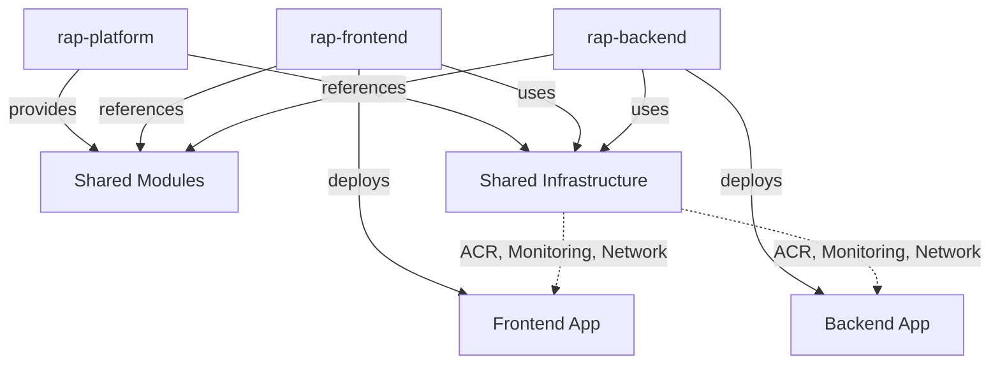
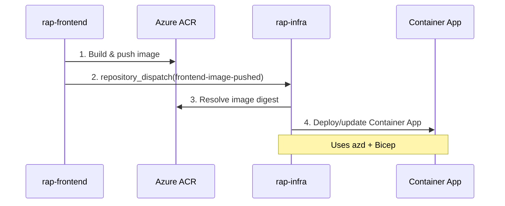

# Multi-Service Infrastructure Architecture Strategies

> **Document Version**: 1.0  
> **Last Updated**: October 17, 2025  
> **Purpose**: Architectural decision guide for organizing infrastructure code across multiple containerized services

---

## Table of Contents

1. [Overview](#overview)
2. [Strategy 1: Monorepo with Centralized Infrastructure](#strategy-1-monorepo-with-centralized-infrastructure)
3. [Strategy 2: Polyrepo with Service-Owned Infrastructure](#strategy-2-polyrepo-with-service-owned-infrastructure)
4. [Strategy 3: Hybrid - Shared Platform + Service-Specific](#strategy-3-hybrid---shared-platform--service-specific)
5. [Current RAP Project Architecture](#current-rap-project-architecture)
6. [Recommended Evolution Path](#recommended-evolution-path)
7. [Decision Framework](#decision-framework)
8. [Implementation Guides](#implementation-guides)
9. [Industry Examples](#industry-examples)

---

## Overview

When building applications with multiple containerized services, there are three primary approaches to organizing infrastructure code:

| Strategy | Best For | Team Size | Complexity |
|----------|----------|-----------|------------|
| **Monorepo Centralized** | Early-stage, tight coupling | 2-10 engineers | Low-Medium |
| **Polyrepo Service-Owned** | Large orgs, full autonomy | 20+ engineers | Medium-High |
| **Hybrid Platform** | Growing teams, balanced control | 10-50 engineers | Medium |

---

## Strategy 1: Monorepo with Centralized Infrastructure

### Overview

Single infrastructure repository manages all services. Application code lives in separate repos but triggers centralized deployment workflows.

### Repository Structure

```
rap-infra/                          # Single infra repository
├── app/
│   ├── frontend-angular.bicep      # Frontend Container App definition
│   ├── backend-azure-functions.bicep  # Backend Container App
│   ├── api-service.bicep           # API service
│   └── worker-service.bicep        # Background worker
├── modules/
│   ├── containerApp.bicep          # Reusable Container App module
│   ├── acrPullRoleAssignment.bicep
│   └── logAnalytics.bicep
├── shared/
│   ├── monitoring.bicep            # Shared Application Insights
│   ├── registry.bicep              # Shared ACR
│   └── apps-env.bicep              # Container Apps Environment
├── .github/workflows/
│   ├── infra-azd.yaml              # Dev deployment (all services)
│   └── promote-image.yaml          # Promotion workflow (all services)
├── main.bicep                      # Entry point
└── main.parameters.json

rap-frontend/                       # Application repos (separate)
├── src/
├── Dockerfile
└── .github/workflows/
    └── build-image.yaml            # Build → dispatch to rap-infra

rap-backend/
├── src/
├── Dockerfile
└── .github/workflows/
    └── build-image.yaml
```

### Workflow Pattern



### Pros ✅

| Benefit | Description |
|---------|-------------|
| **Single Source of Truth** | All infrastructure defined in one place, easy to understand |
| **Consistent Patterns** | Enforced standards across all services (naming, monitoring, RBAC) |
| **Shared Modules** | Reusable Bicep modules reduce duplication |
| **Atomic Changes** | Change multiple services in single PR/commit |
| **Good for Platform Teams** | DevOps/Platform team controls deployment patterns |
| **Easy Cross-Service Changes** | Update shared resources (ACR, monitoring) once |
| **Simplified RBAC** | Single repo to manage access permissions |

### Cons ❌

| Challenge | Impact |
|-----------|--------|
| **Single Bottleneck** | All deployments go through one repo |
| **Tight Coupling** | Changes to one service affect deployment workflow |
| **Limited Autonomy** | Service teams can't deploy independently |
| **CI/CD Complexity** | Workflow grows with service count |
| **Scalability Limit** | Becomes unwieldy with 10+ services |
| **Blast Radius** | Error in workflow affects all services |

### When to Use

- ✅ **Team Size**: 2-10 engineers, single DevOps team
- ✅ **Project Stage**: Early-stage, prototype, MVP
- ✅ **Service Coupling**: Tightly coupled microservices (mini-monolith)
- ✅ **Coordination**: Strong coordination required between services
- ✅ **Deployment Frequency**: < 10 deployments per day across all services
- ✅ **Organizational Maturity**: Single team owns all services

### Example Configuration

```yaml
# .github/workflows/infra-azd.yaml
name: Deploy Service to Dev
on:
  repository_dispatch:
    types: [frontend-image-pushed, backend-image-pushed]

jobs:
  deploy:
    env:
      SERVICE_KEY: ${{ github.event.client_payload.service_key }}  # frontend/backend
      SERVICE_SUFFIX: ${{ github.event.client_payload.service_suffix }}  # fe/be
```

---

## Strategy 2: Polyrepo with Service-Owned Infrastructure

### Overview

Each service repository owns its infrastructure code. No centralized infra repo—service teams are fully autonomous.

### Repository Structure

```
rap-frontend/
├── src/
│   └── app/                        # Angular application
├── infra/
│   ├── frontend.bicep              # Complete infrastructure definition
│   ├── monitoring.bicep
│   ├── main.parameters.json
│   └── modules/
│       └── containerApp.bicep      # Service-specific modules
├── Dockerfile
└── .github/workflows/
    ├── build-image.yaml            # Build container image
    └── deploy-infra.yaml           # Deploy infrastructure + app

rap-backend/
├── src/
│   └── functions/                  # Azure Functions
├── infra/
│   ├── backend.bicep
│   ├── monitoring.bicep
│   ├── main.parameters.json
│   └── modules/
│       └── functionApp.bicep
├── Dockerfile
└── .github/workflows/
    ├── build-image.yaml
    └── deploy-infra.yaml

rap-api/
├── src/
├── infra/
│   └── api.bicep
└── .github/workflows/
```

### Workflow Pattern



### Pros ✅

| Benefit | Description |
|---------|-------------|
| **Full Autonomy** | Service teams deploy independently without coordination |
| **Independent Velocity** | Deploy as fast as your team can move |
| **Clear Ownership** | Each team owns end-to-end (code + infra) |
| **Scalability** | Scales naturally with organization growth |
| **No Bottleneck** | No single point of failure for deployments |
| **Team Boundaries** | Natural organizational boundaries |
| **Technology Freedom** | Teams can choose different tools/patterns |

### Cons ❌

| Challenge | Impact |
|-----------|--------|
| **Infrastructure Drift** | Each team implements patterns differently |
| **Duplicate Code** | Same patterns copied across repos |
| **Standard Enforcement** | Hard to enforce naming, monitoring, security standards |
| **Cross-Service Dependencies** | Complex when services share resources |
| **Multiple Update Points** | Need to update shared resources in N repos |
| **Discovery Complexity** | Where is the ACR? Who owns monitoring? |
| **RBAC Overhead** | Need to manage permissions across many repos |

### When to Use

- ✅ **Team Size**: 20+ engineers, multiple autonomous squads
- ✅ **Project Stage**: Mature product with established patterns
- ✅ **Service Coupling**: Loosely coupled microservices
- ✅ **Coordination**: Minimal coordination required
- ✅ **Deployment Frequency**: 100+ deployments per day across organization
- ✅ **Organizational Maturity**: Strong DevOps culture, well-defined standards

### Example Configuration

```yaml
# rap-frontend/.github/workflows/deploy-infra.yaml
name: Deploy Frontend Infrastructure
on:
  push:
    branches: [main]
    paths: ['infra/**', 'src/**']

jobs:
  deploy:
    steps:
      - name: Deploy Infrastructure
        run: |
          az deployment group create \
            --resource-group rg-frontend-prod \
            --template-file infra/frontend.bicep
```

---

## Strategy 3: Hybrid - Shared Platform + Service-Specific

### Overview ⭐ **RECOMMENDED FOR MOST TEAMS**

Platform team manages shared infrastructure (ACR, monitoring, networking). Service teams own their application infrastructure but reference platform modules.

### Repository Structure

```
rap-platform/                       # Platform team owns
├── shared/
│   ├── monitoring.bicep            # Shared Application Insights
│   ├── registry.bicep              # Shared ACR
│   ├── apps-env.bicep              # Container Apps Environment
│   └── networking.bicep            # VNet, subnets, NSGs
├── modules/                        # Published to Bicep Registry
│   ├── containerApp.bicep          # Standard Container App module
│   ├── functionApp.bicep
│   └── acrPullRole.bicep
├── policies/
│   ├── naming-convention.bicep
│   └── tagging-policy.bicep
└── .github/workflows/
    └── deploy-platform.yaml        # Deploy shared resources only

rap-frontend/                       # Service team owns
├── src/
│   └── app/
├── infra/
│   ├── frontend.bicep              # References platform modules
│   └── main.parameters.json
├── Dockerfile
└── .github/workflows/
    ├── build-image.yaml
    └── deploy-service.yaml         # Deploys service infra only

rap-backend/
├── src/
│   └── functions/
├── infra/
│   ├── backend.bicep               # References platform modules
│   └── main.parameters.json
└── .github/workflows/
    ├── build-image.yaml
    └── deploy-service.yaml
```

### Workflow Pattern



### Pros ✅

| Benefit | Description |
|---------|-------------|
| **Best of Both Worlds** | Platform guardrails + service autonomy |
| **Consistent Standards** | Enforced via shared modules |
| **Independent Deployment** | Services deploy without coordination |
| **Scalable** | Grows with organization |
| **Clear Ownership** | Platform vs. service boundaries well-defined |
| **Reduced Duplication** | Shared modules, not copy-paste |
| **Governance** | Platform team controls critical resources |

### Cons ❌

| Challenge | Impact |
|-----------|--------|
| **More Repositories** | Need to manage platform + N service repos |
| **Module Versioning** | Need strategy for updating shared modules |
| **Initial Complexity** | More setup work than centralized |
| **Organizational Maturity** | Requires clear team boundaries |
| **Documentation Overhead** | Need to document platform APIs |

### When to Use

- ✅ **Team Size**: 10-50 engineers, 3-10 service teams
- ✅ **Project Stage**: Growing from prototype to production
- ✅ **Service Coupling**: Mix of coupled and independent services
- ✅ **Coordination**: Some shared resources, mostly independent
- ✅ **Deployment Frequency**: 20-100 deployments per day
- ✅ **Organizational Maturity**: Emerging platform team

### Example Configuration

**Platform Module (Published to Bicep Registry):**

```bicep
// rap-platform/modules/containerApp.bicep
@description('Container App name')
param name string

@description('Container image')
param image string

@description('Shared Container Apps Environment ID')
param environmentId string

resource containerApp 'Microsoft.App/containerApps@2024-03-01' = {
  name: name
  location: resourceGroup().location
  properties: {
    environmentId: environmentId
    configuration: {
      ingress: {
        external: true
        targetPort: 80
      }
      registries: [
        {
          server: '${acrName}.azurecr.io'
          identity: managedIdentityId
        }
      ]
    }
    template: {
      containers: [
        {
          name: 'main'
          image: image
          resources: {
            cpu: json('0.5')
            memory: '1Gi'
          }
        }
      ]
    }
  }
}
```

**Service Infrastructure (References Platform):**

```bicep
// rap-frontend/infra/frontend.bicep
@description('Environment name')
param environmentName string

// Reference platform-provided shared resources
resource appsEnv 'Microsoft.App/managedEnvironments@2024-03-01' existing = {
  name: '${environmentName}-rap-apps-env'
  scope: resourceGroup('rg-platform-${environmentName}')
}

// Use platform module from Bicep Registry
module containerApp 'br/public:rap/containerApp:1.0.0' = {
  name: 'frontend-app'
  params: {
    name: '${environmentName}-rap-fe'
    image: '${acrName}.azurecr.io/raptor/frontend-${environmentName}:latest'
    environmentId: appsEnv.id
  }
}
```

**Service Deployment Workflow:**

```yaml
# rap-frontend/.github/workflows/deploy-service.yaml
name: Deploy Frontend Service
on:
  push:
    branches: [main]

jobs:
  build-and-deploy:
    steps:
      - name: Build and Push Image
        run: |
          docker build -t $ACR_NAME.azurecr.io/raptor/frontend-dev:$SHA .
          docker push $ACR_NAME.azurecr.io/raptor/frontend-dev:$SHA
      
      - name: Deploy Service Infrastructure
        run: |
          az deployment group create \
            --resource-group rg-frontend-dev \
            --template-file infra/frontend.bicep \
            --parameters image=$ACR_NAME.azurecr.io/raptor/frontend-dev:$SHA
```

---

## Current RAP Project Architecture

### Current State (October 2025)

The RAP project currently implements **Strategy 1 (Monorepo Centralized)** with event-driven integration:

```
rap-infra/                          # ← Infrastructure orchestration
├── app/
│   ├── frontend-angular.bicep
│   └── backend-azure-functions.bicep
├── .github/workflows/
│   ├── infra-azd.yaml              # Dev deployment (triggered by app repos)
│   └── promote-image.yaml          # Promotion (test/train/prod)
└── scripts/
    ├── deploy-service-image.sh     # Parameterized deployment logic
    └── promote-service-image.sh    # Parameterized promotion logic

rap-frontend/                       # ← Application code
└── .github/workflows/
    └── build-image.yaml            # Build → dispatch(rap-infra)
```

### Integration Pattern



### Why This Works for RAP

✅ **Strengths:**
- Small team (prototype phase)
- Centralized deployment control
- Consistent infrastructure patterns
- Good separation: app code vs. infra orchestration
- Parameterized workflows support multiple services

⚠️ **Current Limitations:**
- All deployments route through rap-infra (bottleneck)
- Service teams can't deploy independently
- Workflow complexity grows with each service

---

## Recommended Evolution Path

### Phase 1: Current State (0-3 Services) ✅ **YOU ARE HERE**

**Duration**: 3-6 months  
**Team Size**: 2-10 engineers  
**Services**: Frontend + Backend

**Strategy**: Centralized (Strategy 1)

**Actions**:
- ✅ Parameterize workflows (in progress)
- ✅ Build out frontend + backend
- ✅ Establish deployment patterns
- ✅ Document infrastructure standards

**Stay in Phase 1 While**:
- Small team with tight coordination
- Services are tightly coupled
- Deployment frequency is manageable
- Single DevOps/Platform owner

---

### Phase 2: Growing (3-6 Services) 🎯 **TRANSITION HERE**

**Duration**: 6-12 months  
**Team Size**: 10-20 engineers, 2-3 service teams  
**Services**: Frontend + Backend + API + Worker + ...

**Strategy**: Hybrid (Strategy 3)

**Actions**:

1. **Create Platform Repository**
   ```
   rap-platform/
   ├── shared/
   │   ├── monitoring.bicep
   │   ├── registry.bicep
   │   └── apps-env.bicep
   └── modules/
       └── containerApp.bicep
   ```

2. **Publish Shared Modules**
   - Option A: Azure Bicep Registry
   - Option B: Git submodule
   - Option C: Template specs

3. **Migrate Services**
   ```
   rap-frontend/
   ├── src/
   ├── infra/
   │   └── frontend.bicep  # References platform modules
   └── .github/workflows/
       └── deploy-service.yaml
   ```

4. **Update Workflows**
   - Remove repository_dispatch pattern
   - Each service deploys independently
   - Platform team deploys shared infra

**Migration Steps**:

```powershell
# 1. Create platform repo
gh repo create rap-platform

# 2. Move shared infrastructure
Move-Item shared/ ../rap-platform/
Move-Item modules/ ../rap-platform/

# 3. Add infra/ to service repos
cd rap-frontend
mkdir infra
# Create frontend.bicep referencing platform modules

# 4. Update workflows in service repos
# Remove repository_dispatch, add deployment steps
```

**Success Criteria**:
- ✅ Service teams deploy independently
- ✅ < 1 day to add new service
- ✅ Shared resources updated in single place
- ✅ Platform team maintains standards

---

### Phase 3: Scale (6+ Services) 🚀 **FUTURE STATE**

**Duration**: 12+ months  
**Team Size**: 20+ engineers, 5+ service teams  
**Services**: 6-20 microservices

**Strategy**: Hybrid + GitOps (Strategy 3 Enhanced)

**Actions**:

1. **Implement GitOps**
   - Flux CD or ArgoCD
   - Git as source of truth for desired state
   - Automated reconciliation

2. **Self-Service Platform**
   - Service templates (azd templates)
   - Platform APIs for common operations
   - Developer portal

3. **Advanced Patterns**
   - Feature flags (Azure App Configuration)
   - Progressive delivery (Flagger)
   - Observability (Grafana, Prometheus)

4. **Organizational Practices**
   - Platform team provides APIs
   - Service teams fully autonomous
   - Inner-source shared modules

**Technologies**:
- **GitOps**: Flux CD for reconciliation
- **Templates**: azd templates per service type
- **Observability**: Grafana + Application Insights
- **Policy**: Azure Policy for governance

---

## Decision Framework

Use this framework to choose the right strategy for your context:

### Decision Tree

```
Start Here
│
├─ Team < 10 engineers?
│  └─ YES → Strategy 1 (Centralized)
│  └─ NO  → Continue
│
├─ Services tightly coupled?
│  └─ YES → Strategy 1 (Centralized)
│  └─ NO  → Continue
│
├─ Need platform governance?
│  └─ YES → Strategy 3 (Hybrid)
│  └─ NO  → Continue
│
├─ Multiple autonomous teams?
│  └─ YES → Strategy 2 (Polyrepo)
│  └─ NO  → Strategy 3 (Hybrid)
```

### Key Questions

| Question | Centralized | Polyrepo | Hybrid |
|----------|-------------|----------|--------|
| How many engineers? | 2-10 | 20+ | 10-50 |
| How many services? | 1-5 | 10+ | 3-10 |
| Deployment frequency? | < 10/day | 100+/day | 20-100/day |
| Service coupling? | Tight | Loose | Mixed |
| Team autonomy needed? | Low | High | Medium |
| Platform team exists? | No | No | Yes |
| Standards enforcement? | Manual | Hard | Automated |

### Migration Triggers

**Move from Centralized → Hybrid when**:
- ✅ Team grows beyond 10 engineers
- ✅ Service teams form (2+ squads)
- ✅ Deployment coordination becomes bottleneck
- ✅ Services becoming loosely coupled
- ✅ Platform team emerges

**Move from Hybrid → Polyrepo when**:
- ✅ Organization > 50 engineers
- ✅ 10+ independent service teams
- ✅ Full autonomy required (different tech stacks)
- ✅ Platform standards mature
- ✅ Discovery/observability solved

---

## Implementation Guides

### Guide 1: Setting Up Hybrid Architecture

**Step 1: Create Platform Repository**

```powershell
# Create new platform repo
gh repo create rap-platform --private
cd rap-platform

# Initialize structure
mkdir -p shared modules policies scripts
```

**Step 2: Extract Shared Resources**

```bicep
// shared/apps-env.bicep
@description('Environment name')
param environmentName string

@description('Location')
param location string = resourceGroup().location

resource appsEnv 'Microsoft.App/managedEnvironments@2024-03-01' = {
  name: '${environmentName}-rap-apps-env'
  location: location
  properties: {
    appLogsConfiguration: {
      destination: 'log-analytics'
      logAnalyticsConfiguration: {
        customerId: logAnalytics.properties.customerId
        sharedKey: logAnalytics.listKeys().primarySharedKey
      }
    }
  }
}

output environmentId string = appsEnv.id
```

**Step 3: Create Reusable Module**

```bicep
// modules/containerApp.bicep
@description('App name')
param name string

@description('Container image')
param image string

@description('Environment ID')
param environmentId string

@description('CPU cores')
param cpu string = '0.5'

@description('Memory')
param memory string = '1Gi'

resource containerApp 'Microsoft.App/containerApps@2024-03-01' = {
  name: name
  location: resourceGroup().location
  properties: {
    environmentId: environmentId
    configuration: {
      ingress: {
        external: true
        targetPort: 80
        transport: 'auto'
      }
    }
    template: {
      containers: [
        {
          name: 'main'
          image: image
          resources: {
            cpu: json(cpu)
            memory: memory
          }
        }
      ]
      scale: {
        minReplicas: 1
        maxReplicas: 10
      }
    }
  }
}

output fqdn string = containerApp.properties.configuration.ingress.fqdn
```

**Step 4: Publish Module**

```powershell
# Option A: Bicep Registry (Azure Container Registry)
az bicep publish \
  --file modules/containerApp.bicep \
  --target br:rapplatformacr.azurecr.io/bicep/modules/containerapp:1.0.0

# Option B: Git Submodule
cd ../rap-frontend
git submodule add https://github.com/arif-md/rap-platform infra/platform
```

**Step 5: Update Service Infrastructure**

```bicep
// rap-frontend/infra/frontend.bicep
@description('Environment name')
param environmentName string

@description('Container image')
param image string

// Reference shared platform environment
resource appsEnv 'Microsoft.App/managedEnvironments@2024-03-01' existing = {
  name: '${environmentName}-rap-apps-env'
  scope: resourceGroup('rg-platform-${environmentName}')
}

// Use platform module
module app 'br:rapplatformacr.azurecr.io/bicep/modules/containerapp:1.0.0' = {
  name: 'frontend-app'
  params: {
    name: '${environmentName}-rap-fe'
    image: image
    environmentId: appsEnv.id
    cpu: '1'
    memory: '2Gi'
  }
}

output appUrl string = app.outputs.fqdn
```

**Step 6: Create Service Deployment Workflow**

```yaml
# rap-frontend/.github/workflows/deploy.yaml
name: Build and Deploy Frontend
on:
  push:
    branches: [main, develop]

env:
  ACR_NAME: rapplatformacr
  SERVICE_NAME: frontend

jobs:
  build:
    runs-on: ubuntu-latest
    steps:
      - uses: actions/checkout@v4
      
      - name: Build and Push Image
        run: |
          az acr build \
            --registry $ACR_NAME \
            --image raptor/$SERVICE_NAME-$GITHUB_REF_NAME:$GITHUB_SHA \
            --image raptor/$SERVICE_NAME-$GITHUB_REF_NAME:latest \
            .
  
  deploy-dev:
    needs: build
    if: github.ref == 'refs/heads/develop'
    runs-on: ubuntu-latest
    steps:
      - uses: actions/checkout@v4
      
      - name: Deploy Infrastructure
        run: |
          az deployment group create \
            --resource-group rg-frontend-dev \
            --template-file infra/frontend.bicep \
            --parameters \
              environmentName=dev \
              image=$ACR_NAME.azurecr.io/raptor/$SERVICE_NAME-develop:$GITHUB_SHA
  
  deploy-prod:
    needs: build
    if: github.ref == 'refs/heads/main'
    runs-on: ubuntu-latest
    environment: production
    steps:
      - uses: actions/checkout@v4
      
      - name: Deploy Infrastructure
        run: |
          az deployment group create \
            --resource-group rg-frontend-prod \
            --template-file infra/frontend.bicep \
            --parameters \
              environmentName=prod \
              image=$ACR_NAME.azurecr.io/raptor/$SERVICE_NAME-main:$GITHUB_SHA
```

---

### Guide 2: Publishing Bicep Modules

**Option A: Azure Container Registry (Recommended)**

```powershell
# 1. Create ACR for Bicep modules
az acr create \
  --name rapplatformacr \
  --resource-group rg-platform \
  --sku Standard

# 2. Enable anonymous pull (for public modules)
az acr update \
  --name rapplatformacr \
  --anonymous-pull-enabled true

# 3. Publish module
az bicep publish \
  --file modules/containerApp.bicep \
  --target br:rapplatformacr.azurecr.io/bicep/modules/containerapp:1.0.0

# 4. Reference in service Bicep
module app 'br:rapplatformacr.azurecr.io/bicep/modules/containerapp:1.0.0' = {
  name: 'my-app'
  params: { ... }
}
```

**Option B: Git Submodule**

```powershell
# 1. In service repo
cd rap-frontend
git submodule add https://github.com/arif-md/rap-platform infra/platform

# 2. Reference in service Bicep
module app './platform/modules/containerApp.bicep' = {
  name: 'my-app'
  params: { ... }
}

# 3. Update submodule
git submodule update --remote
```

**Option C: Template Specs**

```powershell
# 1. Create template spec
az ts create \
  --name containerApp \
  --version 1.0.0 \
  --resource-group rg-platform \
  --location eastus \
  --template-file modules/containerApp.bicep

# 2. Reference in service Bicep
module app 'ts:sub-id:rg-platform:containerApp:1.0.0' = {
  name: 'my-app'
  params: { ... }
}
```

---

### Guide 3: Service Team Onboarding (Hybrid Model)

**New Service Checklist**

```markdown
# Adding New Service: API Gateway

## Prerequisites
- [ ] Service team identified (owner: @api-team)
- [ ] Service name agreed: `api-gateway` (key: `api`, suffix: `gw`)
- [ ] Resource group created: `rg-api-dev`, `rg-api-prod`

## Step 1: Repository Setup
- [ ] Create repo: `gh repo create rap-api`
- [ ] Add `infra/` folder
- [ ] Copy `.github/workflows/deploy.yaml` from rap-frontend

## Step 2: Infrastructure Definition
- [ ] Create `infra/api.bicep`
- [ ] Reference platform modules (Container App, monitoring)
- [ ] Define service-specific configuration

## Step 3: Workflow Configuration
- [ ] Update `SERVICE_NAME` in deploy.yaml
- [ ] Configure environment secrets
- [ ] Test deployment to dev environment

## Step 4: Integration
- [ ] Update platform monitoring dashboards
- [ ] Add service to dependency graph
- [ ] Document API endpoints

## Step 5: Production Readiness
- [ ] Security review completed
- [ ] Load testing performed
- [ ] Runbook created
- [ ] On-call rotation configured
```

**Estimated Time**: 2-4 hours for experienced team

---

## Industry Examples

### Microsoft / Azure

**Pattern**: Hybrid Platform

- **Azure Landing Zones**: Central platform team provides governance
- **Azure Verified Modules (AVM)**: Shared, versioned Bicep modules
- **Enterprise-Scale**: Reference architecture for large enterprises

**Key Practices**:
- Platform team owns networking, identity, governance
- Workload teams own application infrastructure
- Modules published to Bicep Registry
- Policy-driven governance

### Netflix

**Pattern**: Polyrepo (Service-Owned)

- 1000+ microservices
- Full autonomy for service teams
- Spinnaker for deployment orchestration
- Strong platform engineering for shared services

**Key Practices**:
- Service teams own end-to-end
- Platform provides "paved road" tools
- Service mesh for cross-service communication
- Automated canary deployments

### Google

**Pattern**: Monorepo + Build System

- Single monorepo with Bazel build system
- All code in one repository
- Atomic changes across services
- Advanced tooling for scale

**Key Practices**:
- Code visibility across org
- Shared libraries easy to update
- Requires sophisticated build tools
- Works at massive scale (2B+ LOC)

### Spotify

**Pattern**: Hybrid Platform

- Platform provides "golden paths"
- Service teams choose own technology
- Backstage for developer portal
- Strong inner-source culture

**Key Practices**:
- Platform team creates self-service tools
- Service teams autonomous within guardrails
- Shared modules via inner-source
- Developer experience focus

### Uber

**Pattern**: Polyrepo + Platform

- Polyrepo for services
- Monorepo for shared libraries
- Strong platform engineering
- Standardized deployment patterns

**Key Practices**:
- Service teams own services
- Platform team provides infrastructure
- Self-service tools for common tasks
- Observability baked in

---

## Summary and Recommendations

### Quick Reference

| Your Situation | Recommended Strategy | Migration Effort |
|----------------|---------------------|------------------|
| Just starting, < 3 services | **Centralized** | N/A |
| Growing team, 3-6 services | **Hybrid** | Medium (2-4 weeks) |
| Large org, 10+ services | **Hybrid** or **Polyrepo** | High (2-3 months) |

### For RAP Project

**Current State**: Strategy 1 (Centralized) ✅ **Correct for now**

**Recommended Timeline**:

```
Now (Oct 2025)              Q1 2026                    Q2-Q3 2026
    │                          │                           │
    ▼                          ▼                           ▼
Centralized              Hybrid Setup              Hybrid Mature
2-3 services            3-6 services               6-10 services
- Frontend              - Create platform repo      - GitOps (optional)
- Backend               - Migrate shared infra      - Self-service
- Parameterize          - Move workflows to repos   - Templates
```

### Key Success Factors

1. **Start Simple**: Don't over-engineer early
2. **Evolve Gradually**: Migrate when pain points emerge
3. **Platform Team**: Required for hybrid/polyrepo success
4. **Documentation**: Critical for any distributed model
5. **Automation**: Invest in CI/CD and self-service tools

### Next Steps for RAP

1. ✅ **Complete current parameterization** (finish promote-image.yaml)
2. ✅ **Test with frontend + backend** (validate patterns work)
3. 🎯 **Plan hybrid transition** (when hitting 3-4 services)
4. 🎯 **Create platform repo** (extract shared infrastructure)
5. 🚀 **Migrate services gradually** (one service at a time)

---

## Additional Resources

### Azure Documentation
- [Azure Landing Zones](https://learn.microsoft.com/azure/cloud-adoption-framework/ready/landing-zone/)
- [Azure Verified Modules](https://azure.github.io/Azure-Verified-Modules/)
- [Bicep Modules](https://learn.microsoft.com/azure/azure-resource-manager/bicep/modules)
- [Azure Container Apps](https://learn.microsoft.com/azure/container-apps/)

### Industry Patterns
- [Monorepo.tools](https://monorepo.tools/)
- [Backstage.io](https://backstage.io/) - Developer portals
- [Platform Engineering](https://platformengineering.org/)
- [Team Topologies](https://teamtopologies.com/)

### GitOps
- [Flux CD](https://fluxcd.io/)
- [Argo CD](https://argo-cd.readthedocs.io/)

---

**Document Maintenance**:
- Review quarterly or when adding services
- Update after major architectural changes
- Keep industry examples current

**Questions?** Open an issue or reach out to the platform team.
