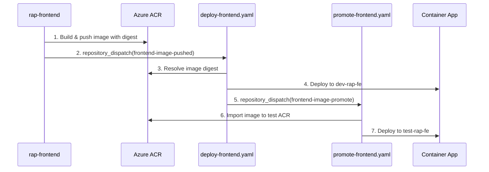

# Service-Specific Workflows Guide

> **Document Version**: 1.0  
> **Last Updated**: October 21, 2025  
> **Purpose**: Guide for using and maintaining service-specific GitHub Actions workflows

---

## Table of Contents

1. [Overview](#overview)
2. [Current Workflows](#current-workflows)
3. [Architecture](#architecture)
4. [Adding a New Service](#adding-a-new-service)
5. [Configuration Requirements](#configuration-requirements)
6. [Workflow Behavior](#workflow-behavior)
7. [Migration from Generic Workflows](#migration-from-generic-workflows)
8. [Troubleshooting](#troubleshooting)

---

## Overview

The RAP infrastructure uses **service-specific workflows** instead of a single generic workflow. This approach provides:

✅ **Clear Ownership**: Each service has dedicated workflows  
✅ **Independent Deployment**: Services deploy without affecting each other  
✅ **Better Filtering**: Workflows only trigger on relevant file changes  
✅ **Reduced Complexity**: No conditional logic to determine which service is deploying  
✅ **Service-Specific Configuration**: Each workflow has its own secrets and outputs  

### Workflow Types

| Type | Purpose | Examples |
|------|---------|----------|
| **Deployment** | Deploy service to dev environment | `deploy-frontend.yaml`, `deploy-backend.yaml` |
| **Promotion** | Promote images across environments (test/train/prod) | `promote-frontend.yaml`, `promote-backend.yaml` |

---

## Current Workflows

### Deployment Workflows

#### Frontend Deployment (`deploy-frontend.yaml`)

**Triggers:**
- Manual: workflow_dispatch
- Push to main branch (when frontend files change)
- Repository dispatch: `frontend-image-pushed` event

**Configuration:**
```yaml
SERVICE_KEY: frontend         # ACR repo: raptor/frontend-{env}
SERVICE_SUFFIX: fe            # Container App: {env}-rap-fe
```

**Outputs:**
- `frontendFqdn`: Frontend application URL

**Path Filters:**
```yaml
paths:
  - 'azure.yaml'
  - 'main.bicep'
  - 'main.parameters.json'
  - 'app/frontend-angular.bicep'
  - 'modules/**'
  - 'shared/**'
  - 'scripts/**'
```

---

#### Backend Deployment (`deploy-backend.yaml`)

**Triggers:**
- Manual: workflow_dispatch
- Push to main branch (when backend files change)
- Repository dispatch: `backend-image-pushed` event

**Configuration:**
```yaml
SERVICE_KEY: backend          # ACR repo: raptor/backend-{env}
SERVICE_SUFFIX: be            # Container App: {env}-rap-be
```

**Outputs:**
- `backendFqdn`: Backend application URL

**Path Filters:**
```yaml
paths:
  - 'azure.yaml'
  - 'main.bicep'
  - 'main.parameters.json'
  - 'app/backend-azure-functions.bicep'
  - 'modules/**'
  - 'shared/**'
  - 'scripts/**'
```

---

### Promotion Workflows

#### Frontend Promotion (`promote-frontend.yaml`)

**Triggers:**
- Manual: workflow_dispatch with image parameter
- Repository dispatch: `frontend-image-promote` event

**Configuration:**
```yaml
SERVICE_KEY: frontend
SERVICE_SUFFIX: fe
```

**Required Secrets:**
- `FRONTEND_REPO_READ_TOKEN`: PAT for accessing frontend source repo

**Promotion Path:**
```
dev → test → train → prod
```

---

#### Backend Promotion (`promote-backend.yaml`)

**Triggers:**
- Manual: workflow_dispatch with image parameter
- Repository dispatch: `backend-image-promote` event

**Configuration:**
```yaml
SERVICE_KEY: backend
SERVICE_SUFFIX: be
```

**Required Secrets:**
- `BACKEND_REPO_READ_TOKEN`: PAT for accessing backend source repo

**Promotion Path:**
```
dev → test → train → prod
```

---

## Architecture

### Integration Flow



### Naming Conventions

| Resource Type | Pattern | Frontend Example | Backend Example |
|---------------|---------|------------------|-----------------|
| **ACR Repository** | `raptor/{key}-{env}` | `raptor/frontend-dev` | `raptor/backend-test` |
| **Container App** | `{env}-rap-{suffix}` | `dev-rap-fe` | `prod-rap-be` |
| **Environment Variable** | `SERVICE_{KEY}_IMAGE_NAME` | `SERVICE_FRONTEND_IMAGE_NAME` | `SERVICE_BACKEND_IMAGE_NAME` |
| **azd env output** | `{service}Fqdn` | `frontendFqdn` | `backendFqdn` |
| **Repository Dispatch** | `{service}-image-{action}` | `frontend-image-pushed` | `backend-image-promote` |

---

## Adding a New Service

### Step 1: Create Deployment Workflow

```bash
# Copy frontend deployment workflow
cp .github/workflows/deploy-frontend.yaml .github/workflows/deploy-{service}.yaml
```

**Edit the new file and update:**

1. **Workflow name** (line 1):
   ```yaml
   name: Deploy {Service} Service
   ```

2. **Service configuration** (lines 27-28):
   ```yaml
   SERVICE_KEY: {service}        # lowercase
   SERVICE_SUFFIX: {suffix}      # 2-3 char abbreviation
   ```

3. **Repository dispatch type** (line 20):
   ```yaml
   types: [ {service}-image-pushed ]
   ```

4. **Path filters** (lines 14-18):
   ```yaml
   paths:
     - 'app/{service}-*.bicep'   # Service-specific Bicep file
     - 'modules/**'
     - 'shared/**'
   ```

5. **Outputs** (line 33):
   ```yaml
   outputs:
     {service}Fqdn: ${{ steps.expose_endpoints.outputs.{service}Fqdn }}
   ```

6. **Accept image step condition** (line 165):
   ```yaml
   if: github.event_name == 'repository_dispatch' && github.event.action == '{service}-image-pushed'
   ```

7. **Fast path condition** (line 201):
   ```yaml
   if: (github.event_name == 'repository_dispatch' && github.event.action == '{service}-image-pushed') || github.event_name == 'workflow_dispatch'
   ```

8. **Prepare promotion step condition** (line 273):
   ```yaml
   if: success() && github.event_name == 'repository_dispatch' && github.event.action == '{service}-image-pushed'
   ```

9. **Source repo variable** (line 283):
   ```yaml
   SRC_REPO='${{ github.event.client_payload.sourceRepo || vars.{SERVICE}_SOURCE_REPO || '' }}'
   ```

10. **Promotion dispatch event** (lines 301, 325):
    ```yaml
    event-type: {service}-image-promote
    ```

11. **Expose endpoints step** (lines 346-393):
    ```yaml
    RAW=$(azd env get-value {service}Fqdn 2>/dev/null || true)
    APP_NAME=$(echo "${AZURE_ENV_NAME}-rap-{suffix}" | tr '[:upper:]' '[:lower:]')
    azd env set {service}Fqdn "$FQDN" >/dev/null || true
    echo "{service}Fqdn=$FQDN" >> $GITHUB_OUTPUT
    echo "{Service} URL: https://$FQDN"
    echo "- {Service}: https://$FQDN"
    ```

### Step 2: Create Promotion Workflow

```bash
# Copy frontend promotion workflow
cp .github/workflows/promote-frontend.yaml .github/workflows/promote-{service}.yaml
```

**Use PowerShell to make bulk replacements:**

```powershell
$file = ".github/workflows/promote-{service}.yaml"
$content = Get-Content $file -Raw

# Update workflow name
$content = $content -replace 'name: Promote Frontend Image', 'name: Promote {Service} Image'

# Update service configuration
$content = $content -replace '# Frontend service configuration', '# {Service} service configuration'
$content = $content -replace 'SERVICE_KEY: frontend', 'SERVICE_KEY: {service}'
$content = $content -replace 'SERVICE_SUFFIX: fe', 'SERVICE_SUFFIX: {suffix}'

# Update repository dispatch type
$content = $content -replace 'frontend-image-promote', '{service}-image-promote'

# Update secrets/tokens (use uppercase SERVICE name)
$content = $content -replace 'FRONTEND_REPO_READ_TOKEN', '{SERVICE}_REPO_READ_TOKEN'

# Update FQDN references
$content = $content -replace 'frontendFqdn', '{service}Fqdn'

# Update input description
$content = $content -replace 'raptor/frontend-dev', 'raptor/{service}-dev'

# Save changes
$content | Set-Content $file -NoNewline
```

### Step 3: Create Bicep Infrastructure

Create `app/{service}-*.bicep` file defining your Container App. Use existing files as templates:

```bicep
// app/{service}-container-app.bicep
param name string
param location string = resourceGroup().location
param tags object = {}

param identityName string
param containerRegistryName string
param containerAppsEnvironmentName string
param applicationInsightsName string
param exists bool
@secure()
param appDefinition object

// ... rest of Container App definition
```

### Step 4: Configure GitHub Secrets and Variables

**Repository Secrets:**
- `{SERVICE}_REPO_READ_TOKEN`: PAT for accessing service source repository

**Environment Variables** (per environment: dev/test/train/prod):
- `{SERVICE}_SOURCE_REPO`: Source repository (e.g., `owner/rap-{service}`)
- `AZURE_ENV_NAME`: Environment name (dev/test/train/prod)
- `AZURE_RESOURCE_GROUP`: Resource group for this environment
- `AZURE_ACR_NAME`: ACR name for this environment

### Step 5: Update Source Repository

In your application repository (`rap-{service}`), update the build workflow to dispatch to the new workflow:

```yaml
# rap-{service}/.github/workflows/build-image.yaml
- name: Dispatch to infrastructure repo
  uses: peter-evans/repository-dispatch@v3
  with:
    token: ${{ secrets.GH_PAT_REPO_DISPATCH }}
    repository: owner/rap-infra
    event-type: {service}-image-pushed
    client-payload: |
      {
        "image": "${{ steps.build.outputs.imageDigest }}",
        "sourceRepo": "${{ github.repository }}",
        "targetEnv": "dev"
      }
```

---

## Configuration Requirements

### GitHub Repository Secrets

| Secret | Scope | Purpose | Example |
|--------|-------|---------|---------|
| `AZURE_CLIENT_ID` | Repository | Service principal for OIDC | `12345678-1234-...` |
| `AZURE_TENANT_ID` | Repository | Azure tenant ID | `87654321-4321-...` |
| `AZURE_SUBSCRIPTION_ID` | Repository | Azure subscription ID | `abcdef12-3456-...` |
| `GH_PAT_REPO_DISPATCH` | Repository | PAT for cross-repo dispatch | `ghp_...` |
| `FRONTEND_REPO_READ_TOKEN` | Repository | PAT for frontend source repo | `ghp_...` |
| `BACKEND_REPO_READ_TOKEN` | Repository | PAT for backend source repo | `ghp_...` |

### GitHub Environment Variables

**Dev Environment:**
```yaml
AZURE_ENV_NAME: dev
AZURE_RESOURCE_GROUP: rg-raptor-dev
AZURE_ACR_NAME: ngraptordev
AZURE_ACR_RESOURCE_GROUP: rg-raptor-dev
FRONTEND_SOURCE_REPO: owner/rap-frontend
BACKEND_SOURCE_REPO: owner/rap-backend
```

**Test Environment:**
```yaml
AZURE_ENV_NAME: test
AZURE_RESOURCE_GROUP: rg-raptor-test
AZURE_ACR_NAME: ngraptortest
PROMO_AZURE_ACR_NAME: ngraptortest
PROMO_AZURE_RESOURCE_GROUP: rg-raptor-test
```

**Production Environment:**
```yaml
AZURE_ENV_NAME: prod
AZURE_RESOURCE_GROUP: rg-raptor-prod
AZURE_ACR_NAME: ngraptorprod
```

---

## Workflow Behavior

### Deployment Workflow Logic

1. **Trigger Detection**: Determines how workflow was triggered
   - `push`: Infrastructure changes (full `azd up`)
   - `workflow_dispatch`: Manual deployment
   - `repository_dispatch`: Image built by app repo (fast path)

2. **Image Resolution**:
   - **Push/Manual**: Query ACR for latest image in `raptor/{service}-{env}`
   - **repository_dispatch**: Use image provided in payload

3. **Deployment Path**:
   - **Fast Path** (repository_dispatch): Update Container App image only (~30 seconds)
   - **Full Path** (push/manual): `azd up` provisions + deploys (~3-5 minutes)

4. **Post-Deployment**:
   - Tag Container App with image digest and commit SHA
   - Dispatch promotion event (if from repository_dispatch)

### Promotion Workflow Logic

1. **Plan Job**: Determines promotion path based on source environment
   - `dev` → `test`
   - `test` → `train`
   - `train` → `prod`

2. **Import Image**: Copy image manifest from source ACR to target ACR

3. **Deploy**: Update Container App in target environment with promoted image

4. **Notification**: Send email with release notes (extracted from OCI labels)

---

## Migration from Generic Workflows

### ✅ Migration Complete (October 25, 2025)

The generic workflows (`infra-azd.yaml`, `promote-image.yaml`) have been **removed** to prevent duplicate workflow runs.

**What was removed:**
- ❌ `.github/workflows/infra-azd.yaml` (deprecated generic deployment)
- ❌ `.github/workflows/promote-image.yaml` (deprecated generic promotion)

**What remains (active):**
- ✅ `.github/workflows/deploy-frontend.yaml`
- ✅ `.github/workflows/deploy-backend.yaml`
- ✅ `.github/workflows/promote-frontend.yaml`
- ✅ `.github/workflows/promote-backend.yaml`

### Why We Migrated

The original generic workflows had these downsides:

❌ **Duplicate runs** - Both generic and service-specific workflows triggered  
❌ Complex conditional logic  
❌ Single point of failure for all services  
❌ Difficult to trace which service is deploying  
❌ Shared secrets increase security risk  
❌ Path filters trigger on any service change  

### Benefits of Service-Specific Workflows

✅ **No duplicate runs** - Each event triggers exactly one workflow  
✅ Clear service ownership  
✅ Independent deployment cycles  
✅ Service-specific secrets  
✅ Cleaner workflow history  
✅ Better observability  

### For New Services

When adding a new service, copy and modify the existing service-specific workflows. See "Adding a New Service" section above for the complete 11-step process.

---

## Troubleshooting

### Common Issues


#### Workflow Not Triggering

**Symptom**: Service-specific workflow doesn't run after push

**Diagnosis:**
```bash
# Check workflow exists
gh workflow list

# Check last run
gh run list --workflow=deploy-frontend.yaml
```

**Solutions:**
- Verify path filters match changed files
- Check branch name matches trigger (usually `main`)
- Ensure workflow file is in `.github/workflows/` directory

---

#### Image Not Found in ACR

**Symptom**: "No image found in ACR for repo 'raptor/{service}-{env}'"

**Diagnosis:**
```bash
# Check ACR repository exists
az acr repository list -n {acrName}

# Check images in repository
az acr repository show-tags -n {acrName} --repository raptor/{service}-dev
```

**Solutions:**
- Verify app repo successfully built and pushed image
- Check ACR repository naming: `raptor/{service}-{env}`
- Ensure ACR exists in target environment
- Review app repo build workflow logs

---

#### Repository Dispatch Not Working

**Symptom**: App repo builds but infra workflow doesn't trigger

**Diagnosis:**
```bash
# Check dispatch event in infra repo
gh api /repos/{owner}/rap-infra/dispatches

# Check PAT token permissions
gh auth status
```

**Solutions:**
- Verify `GH_PAT_REPO_DISPATCH` secret has correct permissions:
  - Classic PAT: `repo` scope
  - Fine-grained PAT: `Actions: Read+write`, `Contents: Read+write`
- Ensure event type matches: `{service}-image-pushed`
- Check target repository is correct

---

#### Wrong Environment Variable

**Symptom**: "SERVICE_FRONTEND_IMAGE_NAME" but expecting "SERVICE_BACKEND_IMAGE_NAME"

**Diagnosis:**
```bash
# Check workflow file SERVICE_KEY
grep "SERVICE_KEY:" .github/workflows/deploy-backend.yaml
```

**Solutions:**
- Verify `SERVICE_KEY` matches service name (lowercase)
- Check `SERVICE_KEY_UPPER` computation in workflow
- Review azd environment variable: `azd env get-value SERVICE_{KEY}_IMAGE_NAME`

---

#### Promotion to Wrong Environment

**Symptom**: Image promoted to wrong target environment

**Diagnosis:**
```bash
# Check promotion plan output
gh run view {run-id} --log | grep "Promotion plan"
```

**Solutions:**
- Verify source environment naming: `{service}-dev`, `{service}-test`, etc.
- Check `PROMO_ENV_NAME` variable in GitHub Environment
- Review promotion path logic in `promote-{service}.yaml`

---

#### Missing FQDN Output

**Symptom**: Workflow completes but no FQDN in output

**Diagnosis:**
```bash
# Check Container App exists
az containerapp show -n {env}-rap-{suffix} -g {resourceGroup}

# Check azd environment
azd env get-value {service}Fqdn
```

**Solutions:**
- Verify Container App has ingress configured
- Check `SERVICE_SUFFIX` matches Container App naming
- Ensure Container App deployed successfully
- Review "Expose deployment endpoints" step logs

---

### Debug Mode

Enable verbose logging in workflows:

```yaml
env:
  ACTIONS_STEP_DEBUG: true
  ACTIONS_RUNNER_DEBUG: true
```

### Useful Commands

```bash
# List all workflows
gh workflow list

# View workflow runs
gh run list --workflow=deploy-frontend.yaml --limit 10

# View run details
gh run view {run-id} --log

# Manually trigger workflow
gh workflow run deploy-frontend.yaml --ref main

# Cancel running workflow
gh run cancel {run-id}

# Re-run failed workflow
gh run rerun {run-id}
```

---

## Best Practices

### Workflow Naming

✅ **Good:**
- `deploy-frontend.yaml`
- `deploy-backend.yaml`
- `promote-api.yaml`

❌ **Avoid:**
- `frontend.yaml` (unclear purpose)
- `deploy.yaml` (too generic)
- `infra-frontend-deploy.yaml` (redundant prefix)

### Service Keys

✅ **Good:**
- `frontend` (clear, short)
- `backend` (clear, short)
- `api` (clear, short)

❌ **Avoid:**
- `Frontend` (use lowercase)
- `frontend-angular` (too specific)
- `fe` (use as suffix, not key)

### Path Filters

Be specific to avoid unnecessary workflow runs:

```yaml
# Good - specific paths
paths:
  - 'app/frontend-angular.bicep'
  - 'shared/apps-env.bicep'

# Avoid - too broad
paths:
  - '**/*.bicep'
```

### Documentation

- Document service-specific configuration in workflow file comments
- Keep this guide updated when adding services
- Include troubleshooting steps for common issues
- Document environment variable requirements

---

## Summary

**Service-specific workflows provide:**
- ✅ Clear ownership and simpler code
- ✅ Independent deployment cycles
- ✅ Better security (service-specific secrets)
- ✅ Easier troubleshooting
- ✅ Scales naturally with service count

**Quick reference for adding a service:**
1. Copy `deploy-frontend.yaml` → `deploy-{service}.yaml`
2. Update 11 key locations (SERVICE_KEY, outputs, events, paths)
3. Copy `promote-frontend.yaml` → `promote-{service}.yaml`
4. Use PowerShell script to replace tokens (6 replacements)
5. Configure GitHub secrets and variables
6. Create service Bicep file in `app/`
7. Update app repo to dispatch events

---

**Questions or issues?** Open an issue in the repository or consult the [Architecture Strategies](./ARCHITECTURE-STRATEGIES.md) guide for broader context.
